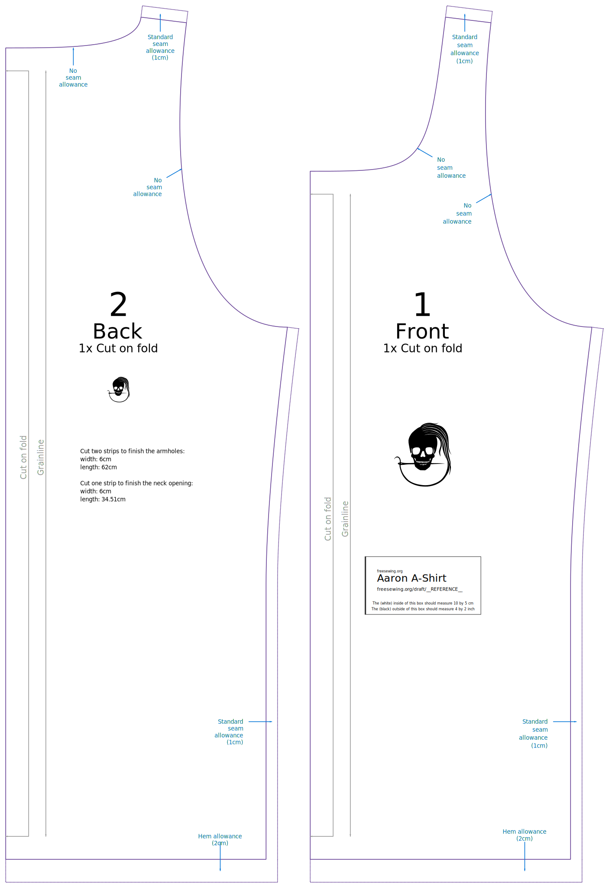
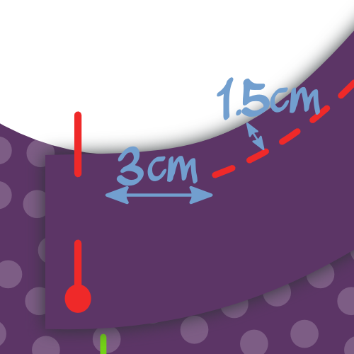

## Ce dont vous avez besoin

Pour réaliser Aaron, vous aurez besoin de ce qui suit :

- Fournitures de base pour la couture
- Environ 0,75 m d'un tissu adapté ([voir les options de Tissu](#fabric-options))

> #### Une surjeteuse est bien pratique mais optionnelle
>
> Comme pour tous les tissus de type maille et élastique, une surjeteuse vous simplifiera la vie.
>
> Si vous n'en avez pas, ne désespérez pas, vous n'en avez pas vraiment besoin. 
> Vu que les coutures des côtés et des épaules ne vont pas être étirées, vous pouvez les réaliser simplement avec un point droit basique.

## Options de tissu

Un débardeur est de manière générale un sous-vêtement. En cette qualité, vous voudriez quelque chose de confortable, agréable contre votre peau and respirant.

Du coton avec une touche de matière élastique, peut-être de la rayonne ou bien une maille fine. Je vous suggère de faire un tour dans votre boutique de tissu favorite et de tâter quelques étoffes.

> Bien que l'aspect élastique ne soit pas indispensable, il est tout à fait à propos pour les sous-vêtements. Cela étant dit, vous pouvez réaliser cette pièce dans un tissu non élastique, veillez simplement à choisir une coupe ample ou décontractée.

## Découpe

 - Coupez **1 dos** au pli
 - Couper **1 devant** au pli
 - Couper **3 bandes** pour la finition de l'encolure et des emmanchures

> #### Mises en garde
> 
>  - Il n'y a pas de marge de couture pour les emmanchures 
>  - Il n'y a pas de marge de couture pour l'encolure
>  - Il y a une marge supplémentaire pour l'ourlet

Aaron est un patron très simple, qui consiste en deux parties principales et quelques bandes pour la finition de l'encolure et des emmanchures.

Ci-dessous une ébauche typique de ce patron:

> La [légende des notations](/fr/docs/patterns/notation) explique la signification des différents marquages et des lignes sur votre ébauche.

## Construction

### Etape 1 : Assemblage du dos et du devant

Disposer le devant et le dos l'un sur l'autre endroit contre endroit. 
Assembler et surfiler les côtés et les épaules.

### Etape 2 : Finition de l'ourlet

Pliez le tissu au bas du vêtement vers le haut, et fixez-le. Si vous disposez d'une recouvreuse, faites-la travailler. Sinon, utilisez une aiguille double ou un point zig-zag pour conserver l'élasticité.

> #### Pliez une seule fois pour éviter les surépaisseurs
> Les tissus en maille ne s'effilochent pas, alors vous pouvez simplement plier une seule fois, coudre pour fixer l'ourlet puis couper l'excédent de tissu de façon bien nette.

### Step 3: Coudre les biais de finition

> #### A propos des biais en jersey
>
> Si vous débutez avec la [finition au biais](/fr/docs/sewing/knit-binding), vous pourriez être intéressés par [cette page sur le sujet](/fr/docs/sewing/knit-binding).
>
> ##### Répéter l'étape 3 et 4 pour les deux emmanchures et l'encolure
> 
> La procédure ci-dessous s'applique à la fois aux emmanchures et à l'encolure. En d'autres termes, vous aurez à la suivre trois fois.
> 
> ##### Commencer avec l'ouverture la plus simple
>
> Je vous conseille de débuter avec l'ouverture qui a la courbure la plus uniforme. Par défaut, il s'agit des emmanchures, mais si vous avez changé les options du patron (dos nageur par exemple), ce n'est peut-être pas le cas.
>
> Dans tous les cas, le moins vous avez de courbure prononcée, plus facile cela sera. Alors commencez avec les courbes douces pour vous échauffer avant de vous attaquer aux courbes plus délicates.

Nous allons finir les ouvertures au niveau des bras et du cou avec la [finition au biais](/fr/docs/sewing/knit-binding) 
(notez que ce n'est pas un parement. La différence est expliquée [ici](/fr/docs/sewing/knit-binding)).

> C'est la seule partie de réalisation de ce débardeur qui requiert un petit peu de pratique. Rassurez-vous, tout ce que vous avez à faire est d'en faire quelques uns et vous deviendrez des pros en un rien de temps.

#### Choisir son emplacement
    

La première décision que nous devons prendre est l'emplacement où nous allons commencer/arrêter notre biais. Voilà ce que je suggère :

  - Pour les emmanchures : au niveau de la couture du côté. Cela cachera notre couture sous le bras
  - Pour l'encolure : au niveau du milieu du dos. Vous voudrez peut-être le marquer avec un épingle

#### Placer (le début) de votre biais

Disposez votre débardeur sur l'endroit, et placez votre bande de biais dessus à l'envers (donc endroit contre endroit).

Aligner le côté long de votre bande avec le bord de votre tissu de telle sorte que la bande repose entièrement sur le tissu (pas dans l'ouverture). Placer l'extrémité sur votre point de démarrage.

Maintenant décaler votre bande de biais d'1 cm au delà de votre point de démarrage. Ce petit surplus garantira que nous pourrons joindre les deux extrémités plus tard.

> La méthode facile de garder cette distance de 1,5 cm est d'utiliser une jauge de couture. 
> Ou de faire ce que je fais, placer un morceau de masking tape sur votre machine à coudre et marquer une ligne de 1,5 cm à partir de l'aiguille. 
> Puis tout ce que vous avez à faire est de garder le bord du tissu aligné avec cette ligne.

#### Veiller à savoir où coudre exactement

Nous allons coudre à 1,5 cm du bord. Alors soyez consciencieux car ce n'est pas une marge de couture standard.

Donc, nous ne commençons pas à notre point de départ, mais nous sautons les 3 premiers centimères. Nous aurons besoin de cette espace plus tard pour joindre les extrémités du biais.

#### Coudre le biais en place

Cousez le biais en place en étirant gentiment le biais, mais pas le tissu. Veillez bien à ne pas coudre le 3 derniers cm, comme vous l'avez fait au début.

Il se peut que vous ayez besoin de vous entraîner un peu pour prendre le coup de main.

> Veillez à étirer votre biais un peu plus lorsque vous prenez un virage plus serré. 
> Lire mes notes sur la [finition au biais](/fr/docs/sewing/knit-binding) pour plus d'informations.

#### Marquer la fin du biais

Avec environ 6 cm que nous avons laissé avant de terminer notre cercle, il est grand temps de joindre les extrémités de notre biais.
    

Prenez un des bords, et étirez-le le long des 3 cm le séparant du point de départ comme vous le feriez si vous le cousiez.

Marquez l'emplacement où le biais rencontre le point de départ. Faites la même chose pour l'autre extrémité.

#### Coudre ensemble les extrémités du biais

Plier votre débardeur de la façon qui facilite le plus pour vous le fait de placer les extrémités du biais endroit contre endroit, en alignant les marquages. Assemblez-les au niveau du marquage.

> 6 cm ce n'est pas beaucoup, mais cela devrait être suffisant pour placer les deux extrémités confortablement sous le pied de votre machine pour les coudre ensemble.

#### Finir les 6 derniers cm de biais

Maintenant que vos extrémités de biais sont cousues ensemble, il est temps de finir de coudre les 6 derniers cm de biais. Piquez-les, en restant à une distance de 1,5 cm comme précédemment.

### Etape 4 : Replier le biais vers l'intérieur et le piquer

#### Rabattre votre biais par dessus le bord du tissu vers l'intérieur
    

Rabattez le biais autour du tissu vers l'intérieur de votre débardeur. C'est ainsi que nous allons le fixer.

> Bien que le biais soit plié deux fois sur l'avant (cachant de ce fait la bordure du tissu), il n'est pas nécessaire de le faire à l'arrière. Nous allons simplement couper l'excédent plus tard, étant donné que les tissus en maille ne s'effilochent pas. Si nous décidions de plier à l'arrière également, cela ne ferait qu'augmenter l'épaisseur.

#### Coudre le biais

Sur l'endroit de votre tissu, cousez le bord interne de votre biais (le plus éloigné de la bordure), en veillant bien à ce que l'arrière du biais soit également pris dans la couture.

> Si vous avez une recouvreuse, elle serait parfaite pour cette couture

Vous aurez, une fois encore, à étirer un peu votre biais en faisant cela. Mais dans ce cas, il y a une mise en garde supplémentaire à prendre en compte.

> #### Faites attention à une potentielle avancée inégale du tissu
> En même temps que vous faites avancer votre biais sur votre machine à coudre, les griffes d'entraînement tirent la couche inférieure (arrière de votre biais). 
>
> Dans un monde parfait, toutes les couches sont parfaitement entrainées et suivent sans problème. 
> Mais bien plus souvent, la couche supérieure (avant de votre biais) tend à être un peu à la traîne. 
> Cela fait que votre biais ne vient pas enserrer joliment le bord de votre tissu, mais au lieu de ça fait d'affreux plis.
>
> Alors prenez garde à ce phénomène, et si vous voyez que cela se produit, étirez légèrement la couche inférieure pour le compenser.

### Etape 5 : Découper l'excédent de biais à l'intérieur

A l'intérieur de votre débardeur, découpez l'excédent de biais le long de votre couture pour la finir.

> Faites attention à ne pas faire de trou dans votre débardeur pendant la découpe. Sérieusement, ça m'est arrivé à plus d'une reprise.

