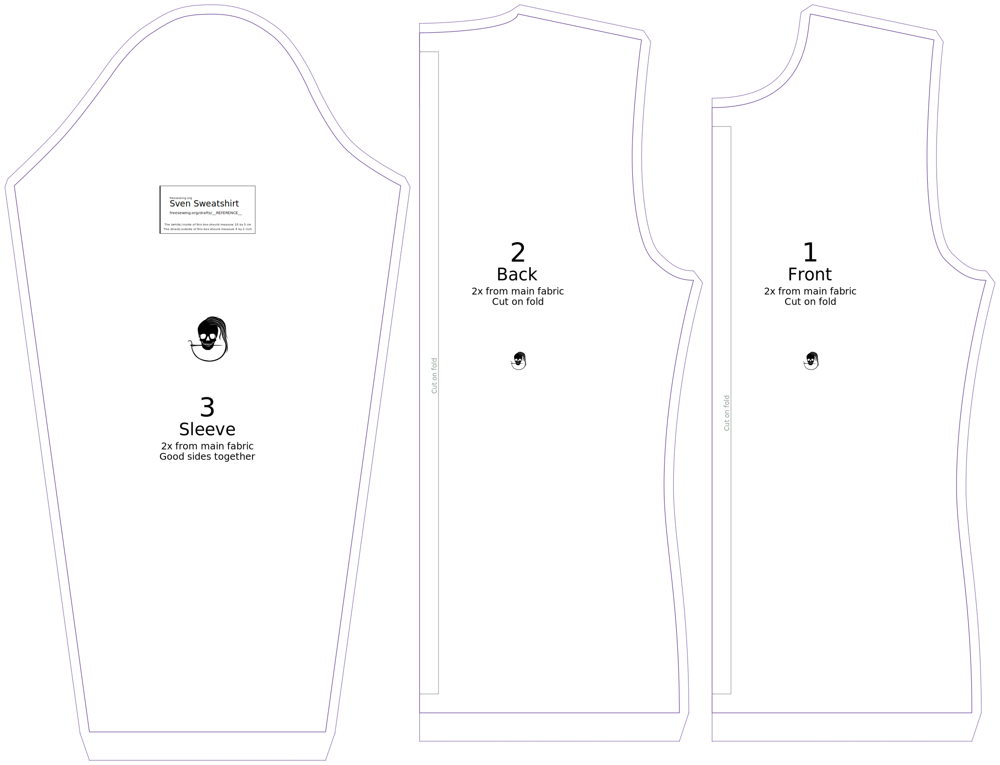

## Ce dont vous avez besoin

Pour réaliser Sven, vous aurez besoin de ce qui suit :

- Fournitures de base pour la couture
- Environ 1,75 m d'un tissu approprié ([voir les Options de tissu](#options-de-tissu))
- Tissu pour la finition des poignets et de l'encolure

> **Une surjeteuse est pratique mais optionnelle**
>
> Comme pour tous les tissus en maille ou élastiques, une surjeteuse vous facilitera la vie.
>
> Si vous n'en possédez pas, ne désespérez pas. Vous n'en avez pas absolument besoin. Car les coutures des côtés et des épaules ne vont pas être étirées, vous pouvez les réaliser avec un simple point droit.

## Options de tissu

Sven peut être n'importe quel sweatshirt que vous voulez qu'il soit. Des étoffes tissés à la maille ou encore du scuba, vous ne pouvez pas vraiment vous tromper du moment que vous choisissiez quelque chose d'un peu lourd.

Jetez un oeil à la [galerie des Sven](/showcase/pattern/sven) pour vous inspirer.

## Découpe

 - **Tissu principal**
   - Coupez **1 dos** au pli
   - Coupez **1 devant** au pli
   - Coupez **2 manches** endroit contre endroit
 - **Tissu de finition**
   - Coupez **1 bande** pour la finition de l'encolure au biais
   - Coupez **2 bandes** pour les poignets
   - Coupez **1 bande** pour l'ourlet

###  Avertissement

Les parties de finition ne sont pas incluses dans le patron étant donné que ce ne sont que de simples rectangles.
Nous allons les déterminer tout en progressant dans le montage.

Sven est un patron très simple, qui consiste en deux parties principales, des manches et quelques bandes pour l'encolure et les poignets.

Ci-dessous une mise en page typique :

% include scalebox.html %}

> La [légende des notations](/fr/docs/patterns/notation) explique la signification de tous les marquages et des lignes sur votre patron.

## Construction

### Etape 1 : Fermer les coutures d'épaule

 - Placez le dos et le devant l'un au dessus de l'autre endroit contre endroit.
 - Alignez la couture d'épaule, et cousez/surjetez à la marge de couture standard.
 - Répétez pour l'autre couture d'épaule.

### Etape 2 : Monter les manches

 - Placez votre devant attaché maintenant au dos à l'endroit. 
 - Placez une manche dessus à l'envers
 - Alignez le haut de la tête de manche avec la couture d'épaule, votre manche devrait reposer sur votre devant/dos s'étendant vers l'autre couture d'épaule
 - Epinglez la manche en place le long de toute l'emmanchure. Il y a un peu d'embu, ce qui signifie que la tête de manche est légèrement plus longue que l'emmanchure. Répartissez l'embu sur le haut de la tête de manche en épinglant.
 - Cousez/surjetez votre manche épinglée en place
 - Répétez pour l'autre manche

### Etape 3 : Finir l'encolure

 - Mesurez la longueur de l'encolure
 - Coupez un morceau de biais de même longueur et de largeur 6cm/2.5inch 
 - Pliez le biais en deux avec l'endroit à l'extérieur, et épinglez-le à l'encolure en partant de l'arrière
 - La partie coupée de votre biais devrait s'aligner sur le bord de l'encolure, alors que le biais devrait s'étendre sur le sweatshirt
 - Epinglez le biais en place autour de l'encolure, en commençant au dos et en l'étirant doucement pendant que vous faites le tour
 - D'abord, joindre le biais au milieu dos, endroit contre endroit. Comme vous avez étiré le biais au fur et à mesure que vous l'avez épinglé, il sera trop long. Coupez l'excédent.
 - Puis, cousez le biais à l'encolure
 
### Etape 4: Fermer les coutures des côtés et des manches

 - Pliez en deux Sven au niveau des coutures d'épaules endroit contre endroit
 - Alignez les coutures des côtés et des manches et épinglez-les
 - Maintenant, cousez la couture côté et continuez pour fermer les manches tout le long jusqu'au poignet
 - Répétez de l'autre côté

### Etape 5 : Assembler les poignets

 - Mesurez la largeur de la manche au niveau du poignet
 - Coupez un morceau de biais qui est (deux fois cette longueur - 2cm/1inch) et 7cm/3inch de large
 - Pliez le biais en deu le long du côté le plus long, et cousez ensemble les bords de façon à obtenir un anneau continu
 - Retournez votre Sven à l'envers
 - Pliez l'anneau de biais avec le côté endroit vers l'extérieur, et insérer le côté plié dans votre manche de Sven mise à l'envers
 - Alignez le côté coupé du biais avec le bord de la manche et épinglez-le en place. Le biais est un peu plus court, alors étirez-le un peu en l'épinglant pour le faire correspondre à la manche.
 - Maintenant, cousez/surjetez le biais à la manche
 - Répétez pour l'autre poignet

### Etape 6: Fixer l'ourlet

 - Faites pour l'ourlet la même chose que ce que vous avez fait pour les poignets
 - Mesurer la largeur de Sven au niveau de l'ourlet
 - Coupez un morceau de biais qui est 1,9 fois cette longueur et 7cm/3inch de large  
 - Vous aurez peut-être à fixer différentes pièces si votre tissu de finition n'est pas assez large
 - Pliez le biais en deux le long du côté le plus long, et cousez les bords ensemble de façon à obtenir un anneau continu
 - Retournez votre Sven à l'envers
 - Pliez l'anneau de biais avec le côté endroit vers l'extérieur, et insérer le côté plié au corps de Sven
 - Alignez le côté coupé du biais avec le bord du corps et épinglez-le en place. Le biais est un peu plus court, alors étirez-le un peu en l'épinglant pour le faire correspondre au corps.
 - Maintenant, cousez/surjetez le biais au corps
