## Vidéo
Le texte est un peu sec pour vous ? J'essaie de réaliser des vidéos disponibles comme parties intégrantes de la documentation des patrons.

Dans ce cas particulier, il y a beaucoup de matériel vidéo disponible, mais il a été originellement enregistré pour une version précédente du patron. Ce sont tout de même de bonnes vidéos.

@[youtube](https://www.youtube.com/embed/videoseries?list=PL1gv5yv3DoZOcmOJf6f0YWi522VXXv-mM)

## Ce dont vous avez besoin

Pour réaliser Theodore, vous aurez besoin de ce qui suit :

 - Fournitures de base pour la couture
 - Environ 2 mètres d'un tissu approprié ([voir les Options de tissu](#options-de-tissu))
 - Environ un mètre de tissu de doublure
 - Entoilage thermocollant pour les poches arrières et la ceinture
 - une fermeture éclair, un bouton et une agrafe pour la braguette

## Options de tissu

Vous avez beaucoup d'options ici, mais gardez à l'esprit que c'est un pantalon de coupe classique. En d'autres termes, n'utilisez pas de tissu élastique, du denim, ou du simili cuir ou ce genre de choses. Des choix peu risqués sont la laine, le coton, ou du lin, possiblement mélangés avec des fibres synthétiques.

Pour la **laine**, regardez dans la section pour costume de votre boutique de tissus. Si c'est votre premier, un mélange polyester/laine va probablement être plus indulgent avec votre portefeuille. Mais ne laissez pas uniquement le prix vous guider, acheter un tissu bon marché fantaisiste est la meilleure façon d'obtenir un pantalon à l'aspect douteux, et être frustré dans le procédé.

Pour le **coton**, optez pour un grammage plus élevé. Le coton peut également être un peu facile pour le débutant que la laine. Si vous n'êtes pas sûr, demander du chino dans la boutique de tissu et choisissez simplement une couleur qui vous plait.

Rien ne surpasse le **lin** un jour de grande chaleur. C'est amusant à travailler aussi, mais il se froisse pour un rien, et même les pantalons réalisés avec la plus grande rigueur ont un aspect quelque peu brouillon lorsqu'ils sont fait en lin. Ce que je veux dire, ce n'est peut-être pas le bon choix pour votre premier pantalon.

## Découpe

 - **Tissu principal**
   - Coupez **2 derrières** endroit contre endroit
   - Coupez **2 devants** endroit contre endroit
   - Coupez **1 ceinture droite**
   - Coupez **1 ceinture gauche**
   - Coupez **2 braguettes** endroit contre endroit
   - Coupez **2 empiècements côté** endroit contre endroit
   - Coupez **4 empiècements poche arrière** 
   - Coupez **8 passants de ceinture** 
 - **Doublure**
   - Coupez **2 doublures devant** endroit contre endroit
   - Coupez **1 doublure ceinture gauche**
   - Coupez **1 doublure ceinture droite**
   - Coupez **1 parement de braguette**
   - Coupez **4 fonds de poche devant** 2x2 endroit contre endroit (**voir les avertissements plus bas**)
   - Coupez **2 fonds de poche arrière interne** 
   - Coupez **2 fonds de poche arrière externe** 
 - **Entoilage**
   - Coupez **1 entoilage ceinture gauche**
   - Coupez **1 entoilage ceinture droite**
   - Coupez **4 entoilage poche arrière**

### Avertissements
 - La **doublure devant** est coupée à partir de la partie **devant** de votre ébauche, vers le bas jusqu'à la ligne juste en dessous du genou
 - Prêtez de l'attention à la ligne de droit-fil sur les **empiècements braguette**, **parement de braguette**,  **empiècement côté**
 - Il y a deux variations du fond de poche avant. Vous devez en couper deux de chaque :
    - Coupez deux pièces complètes
    - Coupez deux pièces s'étendant seulement jusqu'à la ligne en pointillés sur la gauche
 - Le **fond de poche arrière interne** et le **fond de poche arrière externe** sont très similaires. Veillez à les marquer correctement de façon à pouvoir les distinguer.

Ci-dessous une disposition typique d'une ébauche de Theodore :

> La [légende des notations](/fr/docs/patterns/notation) explique la signification de tous les différents marquages et les lignes de votre ébauche.

## Construction

> Beaucoup des étapes ci-dessous doivent être répétées pour les deux jambes. 
>
> Ce n'est pas toujours mentionné parce que la vie est courte et écrire continuellement "N'oubliez pas de faire ceci pour les deux jambes" fatigue très rapidement.

### Etape 1 : Bâtir les lignes de plis

La première chose à faire est de bâtir la ligne de pli des jambes de votre pantalon. Faites le sur les parties devant et derrière de chaque jambe.

### Etape 2 : Fermer les pinces arrières et repasser

### Fermer les pinces arrières

Pliez la pièce 1 (derrière) en deux pour que les crans de la pince sur la ceinture soient alignés, et qu'un pli net aille du cran jusqu'à la fin de la pince. N'hésitez pas à repasser brièvement le pli, cela rendra la couture de la pince plus aisée à effectuer précisément.

Fermez la pince en cousant depuis la ceinture jusqu'à la fin de la pince.

Utiliser un point de faible longueur, et continuez de piquer après la fin de la pince, puis faites un point arrière dans la marge de couture.

#### Couchez les pinces vers les côtés au fer

Aplatir au fer les pinces arrières, en pliant la marge de couture vers les côtés de votre pantalon.

### Etape 3 : Construire les poches arrières

Construire les poches passepoilées doubles à l'arrière de votre pantalon, en incluant le fond de poche.

> **Poche passepoilée double**
>
> Construire une poche passepoilée double est une technique qui est utilisée dans différents vêtements. 
> Voilà pourquoi j'ai fait sa propre page de documentation.
>
> Il y a à la fois de la documentation écrite et une série de vidéos qui vous montre comment faire, alors même si vous n'en avez jamais cousu auparavant, tout ira bien.
>
> [Vers la documentation des poches passepoilées doubles](/fr/docs/sewing/double-welt-pockets)

### Etape 4 : Optionnelle : Découper la doublure avec des ciseaux cranteurs

Si vous allez doubler votre pantalon (c'est optionnel), vous aurez besoin de finir le bord de votre doublure. Pour ce faire, découpez le bord de votre doublure avec des ciseaux cranteurs.

Notez que vous n'aurez besoin de faire cela que pour les bords de votre doublure qui ne sont pas pris dans une couture. En d'autres termes, seulement le bord inférieur de votre doublure.

> Si vous n'avez pas de ciseaux cranteurs, vous pouvez appliquer une autre finition comme un point zigzag, ou utiliser une surjeteuse. Cependant, les ciseaux cranteurs sont les meilleurs pour ce scénario parce qu'ils n'ajoutent aucun volume, ce qui est important car nous voulons éviter que le bord de la doublure fasse une bosse à travers votre pantalon.

### Etape 5 : Découper les pièces pour l'inclinaison de la poche avant

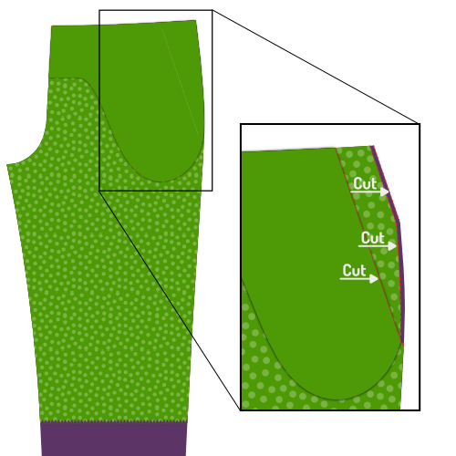

Alignez vos devant, doublure et fond de poche les uns sur les autres. Le devant et le fond de poche à l'envers, la doublure à l'endroit.

Epinglez-les ensemble pour vous assurer qu'ils ne bougent pas. Faites ceci hors de là où la poche est inclinée, pour ne pas vous entraver plus tard.

Découpez le fond de poche (il devrait être au dessus) exactement sur la ligne d'inclinaison de la poche (marquée sur le patron).

Maintenant découpez la partie devant (elle devrait être en bas) 3 cm au-delà de la ligne d'inclinaison, parallèlement à cette dernière.

Enfin, découpez votre doublure de façon à ce qu'elle s'arrête à 0,5 cm du bord de votre devant.

> La doublure est découpée un peu plus courte pour qu'elle ne soit pas visible une fois rabattue. Mais il n'est pas important du tout de la couper exactement 0,5 cm plus courte.

### Etape 6 : Rabattre et coudre la poche avant inclinée

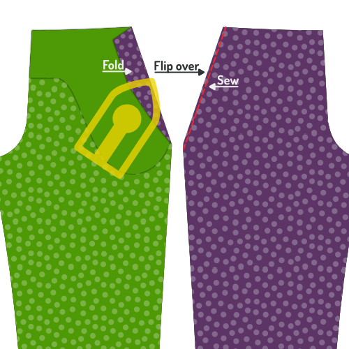

Rabattez votre doublure et la pièce devant le long de la ligne d'inclinaison de la poche (et de ce fait le long du bord découpé du fond de poche). Epinglez et repassez.

Vous allez coudre le long de l'inclinaison de la poche, mais veillez à tout rabattre par dessus de façon à pouvoir coudre sur l'endroit.

Surpiquez à 0,5 cm du pli, en vous assurant de le garder parallèle et de ne pas étirer votre tissu.

> Cette surpiqûre sera toujours apparente, alors soyez sûr d'assortir la couleur de votre fil et de la rendre jolie.

> Pour empêcher vos poches de sortir, vous pouvez placer un morceau de ruban non élastique au milieu du pli. Lorsque vous piquerez, vous allez aussi prendre ce ruban, empêchant la poche de sortir.

### Etape 7 : Finir le bord à l'intérieur de la poche avant

Pliiez de côté la partie principale de la pièce devant, de façon à pouvoir placer la doublure, le fond de poche et le bord plié de la pièce devant à plat.

Faites un point zig-zag le long de la pièce devant rabattue pour la finir et la solidariser avec le fond de poche et la doublure.

### Etape 8 : Repasser la poche côté

Lorsque vous avez fini, placez la pièce devant, la doublure et le fond de poche à plat, et repassez.

> C'est peut-être le bon moment de vous rappeler que chaque étape jusqu'à ce point doit être effectuée pour chaque jambe.
>
> C'est juste un pense-bête amical, les prochaines étapes seront également à répéter pour les deux jambes.

### Etape 9 : Fixer la pièce côté au fond de poche

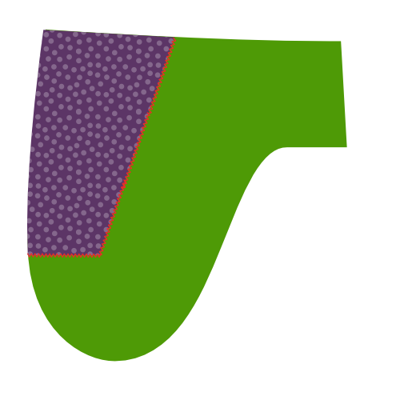

Placez l'autre moitié de fond de poche à l'envers, et alignez la pièce côté dessus à l'endroit.

Coudre un point zig-zag le long du bord de la pièce côté pour la finir et la fixer au fond de poche.

### Etape 10 : Fermer le fond de poche

Placez la pièce devant, la doublure et le fond de poche avec le fond de poche au dessus.

Alignez le second fond de poche avec la pièce côté fixée vers le bas.

Epinglez toutes les pièces ensemble en veillant à rester vers le bord incurvé du fond de poche.

Lorsque tout est épinglé ensemble, rabattez la pièce devant et la doublure, et fermez la courbe du fond de poche.

> Cousez la courbe du fond de poche jusqu'à atteindre le point où il rejoint la pièce côté.

> Vous pouvez finir le fond de poche de nombreuses façons, incluant :
>
> - Surjeter les côtés ensembles
> - Finir le bord avec du biais
> - Coudre les côtés ensemble et finir le bord avec un point zig-zag

### Etape 11 : Repasser la poche avant

Mettez tout à plat avec la pièce devant en dessous, et donnez un bon coup de fer.

### Etape 12 : Epingler la poche devant en place

Epingler la poche sur la pièce le long de l'inclinaison et des bords du fond de poche. 
Cela empêchera de se déplacer pendant que nous continuons à travailler sur notre pantalon.

### Etape 13 : Finir les coutures des côtés

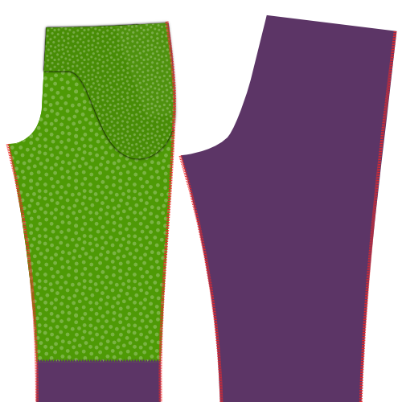

Avant de coudre les coutures des côtés, finissez les bords des côtés en surjetant ou en effectuant un point zig-zag le long de côtés de vos pièces devant et derrière, en vous assurant de rester dans la marge de couture prévue.

> Soyez sûr d'inclure la doublure et les bords des fonds de poche, étant donné que cela empêchera les choses de bouger lorsque nous allons coudre les coutures des côtés.

### Etape 14 : Coudre les coutures des côtés

Placez le devant et le derrière de chaque jambe l'un par dessus l'autre, endroit contre endroit.

Alignez la couture de côté, plus précisément la couture côté sur l'extérieur, où il n'y a pas de courbe d'entrejambe

> Vous pouvez épingler les pièces ensembles pour vous assurez que tout restera en place lorsque vous allez effectuer cette longue couture.

Effectuez la couture, en partant de la ceinture le long du côté de votre pantalon.

### Etape 15 : Ouvrir les coutures

Ouvrez les marges de couture au fer le long des coutures des côtés. Faitez le sur l'envers, et répétez sur l'endroit du tissu.

Prendez votre temps, en veillant à utiliser une température assez élevée, mais pas trop. Utilisez la vapeur ou un vaporisateur d'eau pour un meilleur effet.

> Une couture bien plate a un très bel aspect, alors prenez votre temps pour bien la repasser.

### Etape 16 : Coudre le parement de braguette et la braguette

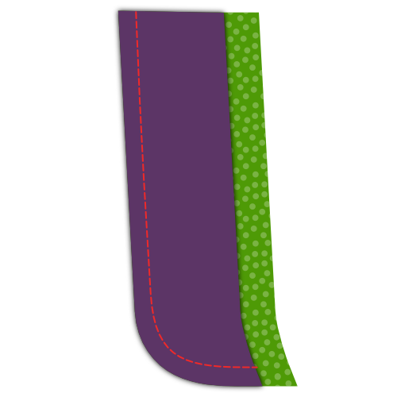

Placez votre braguette sur le parement de braguette endroit contre endroit, et alignez le bord avec la plus grande courbe.

Cousez le long du bord courbe, en prenant en compte la marge de couture standard de 1 cm, pour assembler les deux pièces.

> Si votre doublure a un peu d'élasticité, essayez de l'étirer un peu tout en cousant la courbe. Cela sera plus facile de faire reposer la doublure bien à plat plus tard sans faire de petits plis.

### Etape 17 : Repasser le parement de braguette

> Avant de repasser votre pièce de braguette, veillez à rouler un peu la couture pour le tissu de doublure de votre pantalon soit un peu plus loin, et que la doublure commence seulement à 2 cm environ du bord. Cela empêchera la doublure de déborder à l'extérieur sur le bord.

Après avoir cousu la braguette et le parement de braguette ensemble, retournez-les sur l'envers et repassez la couture que vous venez d'effectuer.

### Etape 18 : Epingler la fermeture éclai à la pièce devant droit

> Les étapes 18 à 21 mènent à une unique rangée de point qui va fixer le zip au devant, tout en attachant la braguette et le parement d'un coup.
>
> C'est la couture la plus difficile à faire dans tout le procédé de construction, alors je prends le temps de vous l'expliquer et de l'illustrer avant que vous commenciez à coudre.

Placez votre pièce devant pour la jambe droite à l'endroit, de façon à ce que la doublure et le fond de poche avant se retrouvent en dessous et soient bien à plat.

Prenez votre fermeture éclair et ouvrez-la (dézippez-la). A présent, retournez-la pour qu'elle soit à l'envers. En d'autres termes, avec la tirette en dessous.

Alignez votre zip avec la couture d'entrejambe telle que montrée sur l'illustration. Prenez bien en compte ce qui suit :

 - La fin de votre zip devrait se trouver en haut de votre pantalon là où la ceinture commencera. Cependant, souvenez vous qu'il y a une marge de couture à cet endroit, alors n'alignez pas avec le haut de la pièce devant, mais soustrayez 1 cm de marge de couture.
 - Alignez le zip avec la couture d'entrejambe. Ne vous préoccupez pas du bord du zip, étant donné qu'ils peuvent être de largeurs différentes. Au lieu de ça, veillez à pouvoir coudre au plus près des dents du zip au sein de la marge de couture de la pièce devant.

Epinglez la fermeture en place avec quelques épingles perpendiculaires à cette dernière (comme montré). Autrement dit, n'épinglez pas au long du zip, mais sur la largeur.

> Si vous n'êtes pas sûr de comment placer votre zip, mettez-le le plus près possible du bord. Faire ainsi impliquera que votre zip est glissé un peu plus loin que la braguette, et qu'il ne sera certainement pas apparent.

### Etape 19 : Epingler le parement de braguette à la fermeture éclair

Prenez votre pièce parement de braguette/braguette que vous avez assemblée au cours des étapes 16 et 17, et placez la avec le tissu à l'envers et la doublure à l'endroit.

Rabattez sur le côté la couche de doublure du dessus, et alignez le bord légèrement courbé du tissu (là où il n'est pas cousu à la doublure) avec le bord du tissu de votre pièce devant.

> Pour plus de clarté, le côté du parement de braguette qui devraiet être à l'endroit est montré en haut de l'illustration, à une échelle plus petite.

Epinglez cette épaisseur en place avec quelques épingles perpendiculaires à votre zip (montrées en rouge). Veillez à prendre toutes les couches en dessous, en incluant le zip. De cette façon, vous pouvez retirer vos épingles de l'étape précédente (montrées en vert) lorsque c'est fait.

> Si vous êtes à l'aise pour maintenir tout cela en place, vous pouvez laisser la doublure repliée en arrière et tout épingler ensemble comme cest montré dans la prochaine étape. C'est en quelque sorte plus rapide, mais cela induit plus de risques d'erreur, comme les choses peuvent bouger plus facilement.

### Etape 20 : Epingler le parement de braguette en place le long du zip

laisser la doublure repliée en place, puis épinglez toutes les couches ensembl le long du zip.

Lorsque vous avez fini, enlevez les épingles que vous avez placées précédemment de façon perpendiculaire.

### Etape 21 : Rabattre le parement de braguette et épingler

{.fs-row2}
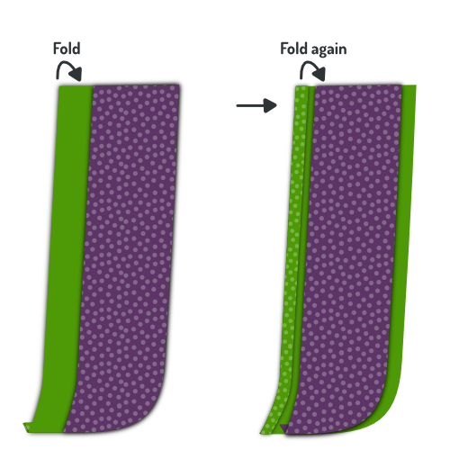{.fs-row2}

Retournez le tout pour que le parement de braguette se retrouve en bas.

Rabattez la doublure du parement de braguette autour de la braguette, de la pièce devant et de la braguette, en vous assurant de la plier en deux pour que le bord non fini soit caché à l'intérieur.

Epinglez-cela, et retirer vos épingles précédentes.

### Etape 22 : Coudre la braguette en place le long du zip

Maintenant vous pouvez coudre le long de la braguette pliée en deux. Cela va fixer en place le devant, la fermeture éclair, le parement de braguette et la braguette.

> Vous allez coudre le long du zip, alors veillez à installer votre pied pour fermeture éclair sur votre machine, si vous en avez un.

### Etape 23 : Rabattre la braguette et repasser

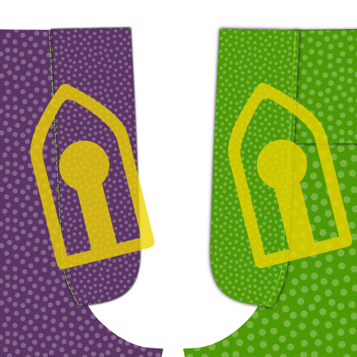

Lorsque vous aveez fini, rabattez la braguette de façon à ce qu'elle s'étende à partir de la pièce devant, et donnez un coup de fer vigoureux depuis l'envers. Et un coup délicat sur l'endroit.

### Etape 24 : Appliquer du biais sur la seconde pièce de braguette et repasser

Appliquer du biais sur le bord avec la courbe large de la seconde pièce de braguette.

Repassez le bord fini lorsque vous aurez terminé.

> Utiliser du biais est une manière de finir une couture. Si vous n'êtes pas sûr de ce que c'est où comment l'appliquer, faites-le moi savoir.

### Etape 25 : Epingler et coudre la pièce de braguette à la couture d'entrejambe

Placez la jambe gauche à l'endroit. Placez la seconde pièce de braguette au dessus à l'envers, en alignant au niveau de la couture non finie d'entrejambe.

Epinglez la pièce de braguette en place, puis cousez-la en place le long de la couture d'entrejambe.

> Lorsque vous cousez en place, veillez à bien prendre la doublure devant.

Repassez le bord fini lorsque vous aurez fini.

### Etape 26 : Rouler la pièce de braguette vers l'arrière, et repasser la couture

Pliez la pièce de braguette vers l'arrière. Avant de repasser, veillez à rouler la couture un peu vers l'arrière pour que le devant de votre pantalon soit un peu plus loin que la pièce de braguette.

De cette manière, la couture ou la pièce de braguette ne sera pas visible à l'avant.

Donnez un bon coup de fer depuis l'envers.

### Etape 27 : Epingler et coudre la fermeture éclair à la pièce de braguette

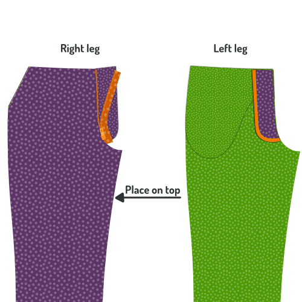{.fs-row3}
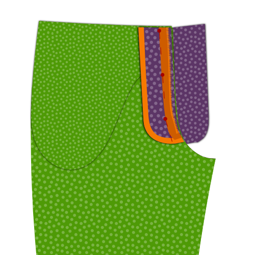{.fs-row3}
{.fs-row3}

Placez la jambe droite à l'endroit puis la jambe gauche par dessus à l'envers.

Avec la couture d'entrejambe alignée, épinglez le zip à l'envers le long du bord de la pièce de braguette.
Veillez à épingler le zip seulement à la pièce de braguette, pas aux autres couches en dessous.

> Je trouve plus facile d'épingler le zip à travers toutes les couches, et puis lorqu'il est bien maintenu en place ajouter des épingles supplémentaires qui ne traversent que le zip et la braguette. Lorsque c'est fait, vous pouvez retirer les épingles qui traversent toutes les couches.

Dernier point mais non le moindre, cousez le long du zip avec votre pied pour fermeture éclair pour le fixer à la braguette.

> Lorsque vous alignez le zip, veillez à prendre en compte ce qui suit :
>
> - Le zip devrait être placé à l'envers
> - Il devrait se trouver un peu en arrière du bord de votre braguette
> - Veillez à bien aligner le haut du zip avec l'autre moitité sur la jambe droite

### Etape 28 : Faites un point zig-zag pour fixer le bord du zip avec la pièce de braguette

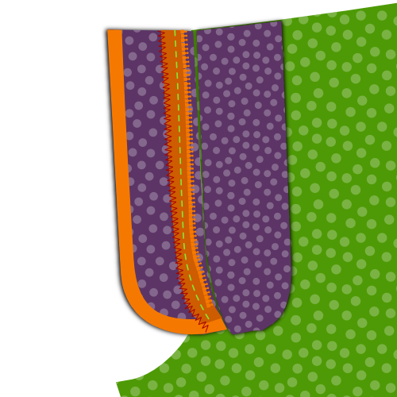

Avec la braguette en place, faites courir un point zig-zag le long du bord du zip pour le fixer à la pièce de braguette.

### Etape 29 : Faire un point d'arrêt sur les pièces de braguette

Placez les deux parties de braguettes ensemble, et écartez les pièces devant hors du chemin.

Utilisez un point d'arrêt pour les assembler en bas du zip. Cousez sur les deux bords du zip, et aussi près que possible de ce dernier que vous le pouvez.

> Si votre zip est trop long, vous pouvez le couper en dessous des points d'arrêt.

### Etape 30 : Réaliser la couture d'entrejambe

{.fs-row2}
{.fs-row2}

Placez les deux devants à l'endroit. Ils sont à présent assemblés par la braguette.

Assurez-vous que la braguette est repliée nettement en dessous, et épinglez les deux devants ensembles en bas de la braguette, où vous avez effectué des points d'arrêt plus tôt. Assurez-vous que l'épingle soit alignée avec le pli de votre devant.

Pliez les devants endroit contre endroit, et épinglez les ensemble le long de l'entrejambe.

Vous aurez besoin de mettre le parement de braguette hors du chemin, de façon à ce que si vous avez épinglé à travers toutes les couches plus tôt, retirez cette épingle maintenant, en vous assurant de la remplacer avec une épingle horizontale. Cela vous indiquera jusqu'où coudre.

Coudre l'entrejambe, en démarrant au point de croisement de l'entrejambe, et en allant vers le haut vers votre épingle.

> Je trouve cette étape difficile à expliquer, et à illustrer. J'espère que cela prendra son sens lorsque vous regarderez votre braguette. Sinon, jetez un oeil aux instructions vidéos.

### Etape 31 : Epingler pour fermer la braguette et bâtir la courbe de la braguette

Fermez la braguette, et épinglez les devants ensemble en veillant à ce que la braguette soit nettement repliée.

Nous allons ensuite surpiquer la courbe de la braguette, et c'est une bonne idée de la bâtir d'abord.

Vous devriez démarrer un peu au-dessus de vos points d'arrêt précédants, et veiller à ne prendre que le parement de braguette de la jambe gauche.

faites une courbe vers le haut, vers le bord du parement de braguette, puis continuez parallèlement au zip.

### Etape 32: Surpiquer la courbe de la braguette

A présent supiquez la courbe de votre braguette, avec votre bâti comme guide.

En faisant cela, vous allez bloquer vos devant, braguette, fond de poche et doublure ensemble.

### Etape 33 : Epingler la couture d'entrejambe

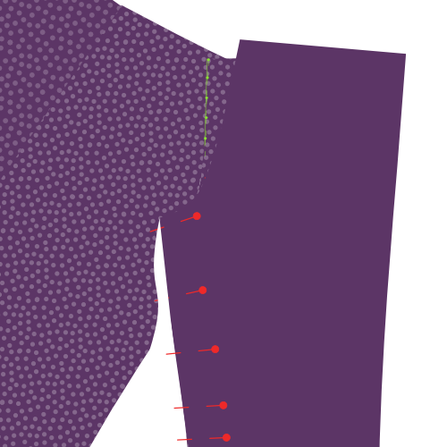

Mettez les jambes l'une par dessus l'autre endroit contre endroit, et épinglez le long de la couture d'entrejambe. Débutez à la fourche et continuez vers le bas des jambes.

N'oubliez pas de la faire pour les deux jambes.

### Etape 34 : Coudre les coutures de l'interieur des jambes

Pour les deux jambes, cousez les coutures de l'intérieur des jambes que vous venez d'épingler. Veillez à bien respecter les marges de couture.

### Etape 35 : Ouvrir les marges de couture de l'intérieur des jambes

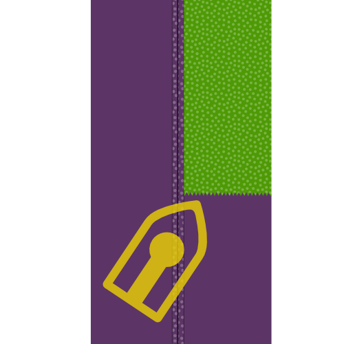

Placez votre jambe sur l'envers, et ouvrez la couture de l'intérieur de la jambe au fer.

### Etape 36 : Fermer la couture de la fourche

Nous allons maintenant fermer la couture de la fourche, du bas de la braguette entre vos jambes, jusqu'à vos fesses au milieu dos où vous ajouterez la ceinture plus tard.

Pour ce faire, retournez une jambe sur l'envers, de façon à ce que le côté endroit du tissu principal soit à l'intérieur, et l'envers et la doublure à l'extérieur.

L'autre jambe ne devrait pas être retournée, mais juste avoir son côté endroit à l'extérieur.

Maintenant, mettez la jambe qui est à l'endroit dans la jambe qui est à l'envers.

De cette façon, les côtés endroits des deux jambes vont se faire face, et c'est ainsi que vous allez effectuer la couture de la fourche.

> Faites attention que votre jambe ne soit pas vrillée dans l'autre jambe. S'il y a un doute, retrournez la jambe qui est à l'envers à l'endroit de nouveau après avoir épinglé la couture de fourche pour vous assurer que tout est bon.

Epinglez la couture de la fourche en place, et puis piquez-la, en commençant du côté de la braguette, et en respectant bien les marges de couture.

Lorsque c'est fait, ouvrez la couture au fer.

### Etape 37 : Repasser les plis des jambes en place

Retournez votre pantalon sur l'endroit, et placez avec attention une jambe sur votre table à repasser de façon à ce qu'elle repose bien à plat et se plie exactement sur la ligne de pli que vous avez bâtie plus tôt.

Lorsque cela paraâit satisfaisant, repassez les lignes de pli sur votre jambe sur l'avant et l'arrière. Répétez pour l'autre jambe.

Donnez un coup de fer bien ferme car vous voulez que les plis restent même après avoir lavé votre pantalon (de façon à savoir où repasser de nouveau).

>Dans l'industrie, des produits chimiques sont appliqués le long de la ligne de pli avant qu'elle soit repassé. Certains tailleurs utilisent une sorte de marteau en bois et une enclume pour frapper les fibres et rendre le pli permanent.

En fonction de votre tissu, votre pli durera plus ou moins longtemps, mais au final, vous ne pouvez pas espérer avoir un pli qui peut résister à plusieurs lavages sans avoir à être reformé au fer.

> Peut-être que cela va sans dire, mais il y a aussi une autre option. Ne repassez pas le pli. Cela donnera un look moins formel à votre pantalon.

### Etape 38 : Thermocollez la ceinture

Thermocollez l'entoilage de la ceinture (Pièce 3) à la ceinture (Pièce 4).

Alignez l'entoilage au milieu de la ceinture, et veillez à le garder bien aligné tout en le fixant au fer.

### Etape 39 : Assembler la ceinture et la doublure de ceinture

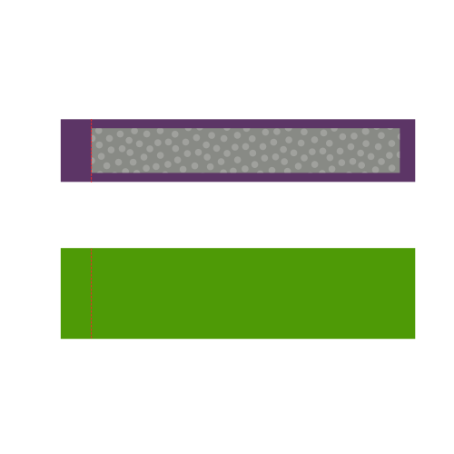

Assembler la ceinture (Pieces 4a and 4b) en cousant les deux pièces ensemble endroit contre endroit.

Assembler la doublure de ceinture (Pieces 5a and 5b) en cousant les deux pièces endroit contre endroit.

### Etape 40 : Coudre la ceinture à la doublure de ceinture

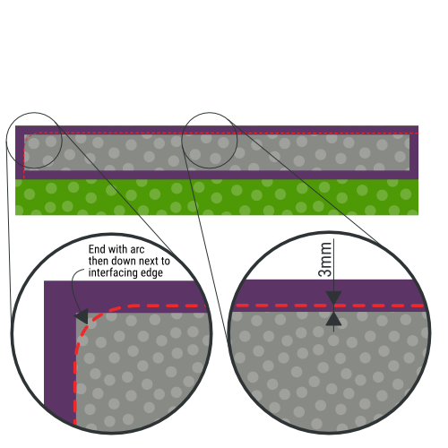

Placez votre ceinture sur sa doublure, endroit contre endroit, de façon à ce que l'entoilage de la doublure de ceinture soit devant vous.

Alignez le bord, et épinglez-les ensemble.

> Nous allons coudre le long de l'entoilage, mais nous allons coudre à environ 3 mm ou 1/8 inch du bord de cet entoilage. Cela empêchera que la doublure soit visible de l'avant plus tard.

Sur un côté de la ceinture, finissez avec une courbe et puis descendez verticalement le long du bord de l'entoilage de ceinture. Regardez bien les illustrations pour être certain que vous le faites du bon côté.

### Etape 41 : Rouler le tissu autour du bord de l'entoilage et repasser la ceinture

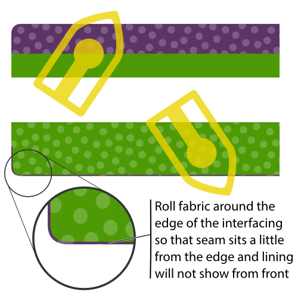

Avant de repasser la ceinture, veillez à rouler le tissu autour du bord de l'entoilage.

Vous souvenezvous que dans l'étape précédente vous avez cousu à 3 mm du bord de l'entoilage ? Vous avez besoin de faire le pli autour du bord de l'entoilage de façon à ce que votre couture soit 3 mm de plus vers l'intérieur.

Cela assurera que votre doublure ne sera jamais apparente sur le devant de votre pantalon.

### Etape 42 : Epingler la ceinture au pantalon

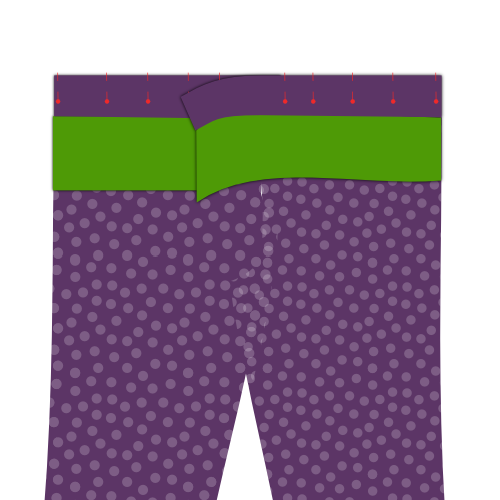

Epingler le bord de votre ceinture (le côté que vous ne l'avez pas cousu avec la doublure) sur le haut de votre pantalon, endroit contre endroit.

Repliez le bord de votre braguette dans la fin de votre ceinture avec le coin courbé. Sur l'autre côté de la ceinture, il sera plus long. Autrement dit, votre ceinture chevauchera ici.

> Veillez à faire correspondre l'alignement vertical de la ceinture au niveau du zip. Avers le zip fermé, les deux côtés de la ceinture devraient être à la même hauteur. Il est facile d'oublier ce détail si vous ne vérifiez pas.

### Etape 43 : Coudre la ceinture au pantalon

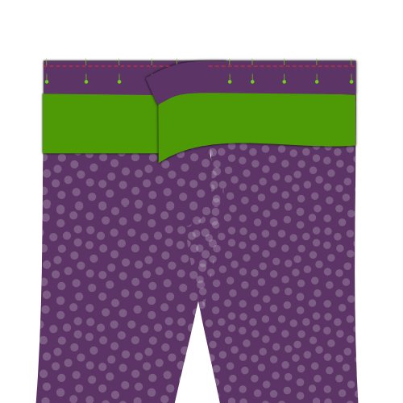

Maintenant que votre ceinture est épinglée au haut de votre pantalon, cousez-la en place.

Sur le côté avec le coin arrondi, cousez le plus près du bord possible. Sur l'autre côté, arrêtez-vous lorsque vous atteignez le bord de votre braguette.

### Etape 44 : Repasser la ceinture

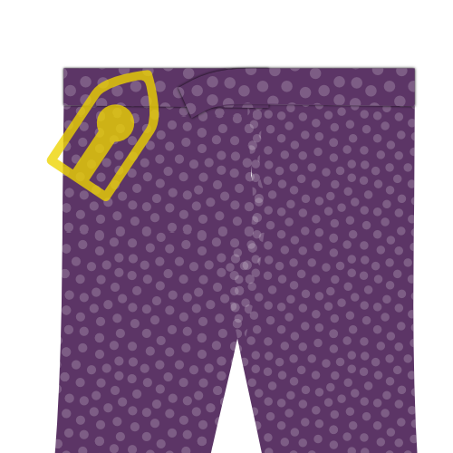

Repasser votre toute nouvelle couture. N'ouvrez pas les marges, mais couchez-les vers le haut (mettez les marges de couture du pantalon et de la ceinture dans la ceinture).

### Etape 45 : Préparer les passants de ceinture

Les passants de ceinture sont une partie de votre pantalon où vous pouvez laisser libre court à votre créativité. Il y a énormément de façons de former des passants de ceinture, sans parler du fait que vous pouvez les positionner à votre guise aussi.

Cela étant dit, voici ce qu'il faut faire pour réaliser un passant de ceinture standard :

Prenez la partie de patron pour le passant de ceinture, un morceau rectangulaire de tissu. Il y en a 8, et ils deviendront chacun un passant de ceinture. Pour chacun d'entre eux, suivez ces étapes :

 - Faites un point zig-zag (ou bien surjetez) les bords longs du rectangle
 - Pliez vers l'arrière un côté le long du bord long, et repassez
 - Pliez vers l'arrière l'autre côté le long du bord long, et repassez
 - Cousez à la main le long de l'arrière du passant de façon à maintenir les côtés pliés en place, mais que les points ne soient pas visibles sur le devant.
 - Repassez de nouveau, et c'est fini

> Tandis que la longueur des passants n'est pas si importante, il faut qu'ils soient de même largeur.
>
> Pour faciliter l'obtention d'une largeur uniforme, vous pouvez plier vos passants autour d'une bande de carton rigide, de papier épais ou de plastique de la largeur de passant désirée.
>
> Cette bande peut également vous aider pour la couture à la main. Gardez-la dans votre passant et elle empêchera votre aiguille de passer à travers toutes les épaisseurs, et votre fil n'apparaîtra pas sur le devant.

### Etape 46 : Assembler les passants : Bas

Attachez le bas des passants de ceinture à votre pantalon. Placez-les à environ 1,5 cm du bord de votre ceinture, en fonction de la largeur de la ceinture.

Placez l'endroit du passant contre l'endroit du pantalon et bloquez-le avec un point d'arrêt ou un point zig-zag.

Puis, faites un point zig-zag sur le bord du passant.

> Il est important de garder la doublure de la ceinture hors du chemin en faisant cela. Veillez à fixer les passants uniquement au pantalon, et non à la doublure de la ceinture.

> Vous avez 8 passants de ceinture, alors vous devez les distribuez autour de la ceinture. Regardez sur un pantalon existant si vous n'êtes pas sûr de la façon de le faire.
>
> Veillez à placer les passants près du milieu dos, et pas trop près les uns par rapport aux autres sur le devant (pour laisser de la place à la boucle de ceinture).

### Etape 47 : Entoilage de ceinture

L'entoilage de ceinture doit être coupé et fixé à votre ceinture.

Cela sera bien plus simple à comprendre si vous jetez un oeil à la vidéo correspondante.

@[youtube](https://www.youtube.com/embed/8dLOuOtb18U?list=PL1gv5yv3DoZOcmOJf6f0YWi522VXXv-mM)

### Etape 48 : Découper le surplus de couture de la ceinture

Avant de finaliser la ceinture, nous allons découper l'excédent de marge de couture s'y trouvant.

> **A propos de la gradation de marge de couture**
> Lorsque vous dégarnissez les différentes couches de marge de couture, essayez toujours de les couper à des largeurs différentes de façon à réduire le volume en étapes incrémentales.
>
> La couche qui se trouve le plus près de l'endroit du vêtement devrait être le plus large, alors découpez à partie de celle-ci.
>
> Faire ainsi diminuera le risque que la bordure de la marge de couture soit visible sur le côté endroit.

### Etape 49 : Repasser et bâtir la doublure de ceinture

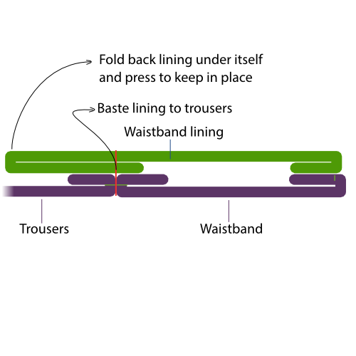

La doublure de ceinture sera cousus depuis le devant du pantlon au dessus de la couture qui joint la ceinture au pantalon (dite, couture dans le sillon).

Faire ainsi permettra de prendre la doublure et de la sécuriser en place. Toutefois, étant donné que nous cousons sur l'endroit, la doublure sera en dessous des autres épaisseurs, et nous ne verrons pas ce que nous faisons.

C'est pourquoi, pour être sûr que tout repose bien proprement à plat, nous allons tout d'abord repasser et bâtir la doublure.

La doublure va s'étendre vers le bas à partir du haut, et elle devra être repliée sur elle-même, de façon à ce qu'elle soit prise dans la couture lorsque nous la fixerons en place plus tard.

Pour veillez à ce que les choses soient jolies, la distance entre le haut de notre ceinture, et le bord inférieur (replié) de notre doublure devrait être régulière. Vous pouvez marquer une distance égale depuis le haut de votre pantalon, et épingler la doublure sur cette ligne. Dernier point mais non le moindre, repassez ce pli sur votre doublure.

Lorsque vous êtes satisfait de l'aspect obtenu, bâtissez la doublure ne place juste à côté de la couture qui assemble la ceinture au pantalon.

> Il est mieux de bâtir à côté de la couture, mais non sur la couture. Cela sera plus facile de retirer le fil de bâti une fois la couture faite dans la prochaine étape.

### Etape 50 : Coudre la doublure de ceinture en place

Après avoir bâti la doublure de ceinture, cousez-la en place sur l'endroit, exactement dans la couture entre la ceinture et le pantalon.

### Etape 51 : Attacher les passants : Haut

Avec votre ceinture et sa doublure proprement bloquées, il est temps d'attacher le haut des passants de ceinture.

Cousez-les en place comme vous l'avez fait pour le bas. A savoir, utilisez un point d'arrêt ou un zig-zag serré pour les fixer, puis un point zig-zag pour les sécuriser.

> Ne cousez pas à travers le haut des passants. Vous devrez travailler le pied de votre machine à coudre sous le passant de façon à ne coudre que sur la partie qui est repliée.

> N'hésitez-pas à découper la longueur de vos passants après avoir fait vos points d'arrêt ou après le point zig-zag sur leur extrémités, comme ils pourraient être trop longs.

### Etape 52 : Finir le bords des jambes

Avant d'ourler le pantalon, finissez le bord des jambes avec un point zig-zag ou un point de surjet.

> C'est également le bon moment d'essayer le pantalon pour marquer exactement la longueur que vous voulez qu'il ait après l'ourlet.

### Etape 53 : (Optionnelle) Coudre un ruban d'ourlet

> Le ruban d'ourlet est un ruban qui se trouve à l'intérieur de votre ourlet de pantalon. A l'endroit où l'ourlet est replié, le tissu subit de mauvais traitements à cause des frottements répétés avec les chaussures et d'autres choses.
>
> Placer un ruban à l'intérieur de l'ourlet protège jusqu'à un certain point votre tissu, et c'est une finition très propre.

Marquer la ligne d'ourlet de votre pantalon (sur l'endroit).

Placez le ruban comme montré dans l'illustration en veillant à ce qu'il dépasse de quelques mm de la ligne d'ourlet. Cousez-le en place tout le tour de la jambe, en veillant à coudre près mais non sur la ligne d'ourlet.

### Etape 54 : Repasser l'ourlet

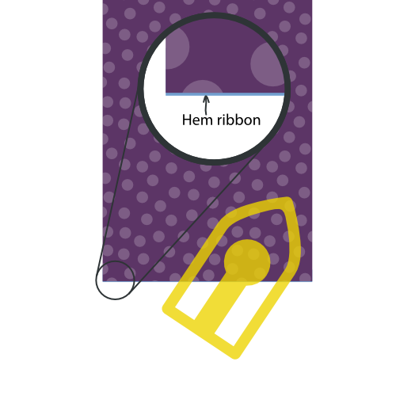

Repliez les jambes de pantalons à la ligne d'ourlet, et repassez l'ourlet.

> Si vous avez cousu un ruban d'ourlet, le ruban va dépasser de quelques mm en dessous de la ligne d'ourlet, protégeant ainsi le tissu au niveau de l'ourlet.

### Etape 55 : Ourler les jambes

Avec l'ourlet proprement repassé, cousez cimplement à la main la partie repliée à l'intérieur de votre pantalon.

> L'ourlet est réalisé à la main car il est important que les points ne soient pas visibles sur le devant. Alors lorsque vous cousez à la main, ne poussez pas l'aiguille à travers le tissu mais attrapez juste quelques fils pour rendre les points invisibles sur le côté endroit du vêtement.
> 
> Bien qu'il y ait des alternatives mécaniques, elles ne sont pas aussi propres (point d'ourlet invisible) et probablement non accessibles au couturier amateur (machine industrielle pour ourlet invisible).

### Etape 56 : Découper les surplus, nettoyer et repasser
Découpez les fils qui pourraient encore dépasser, retirez les fils de bâti, et donnez un coup de fer final à votre pantalon.
