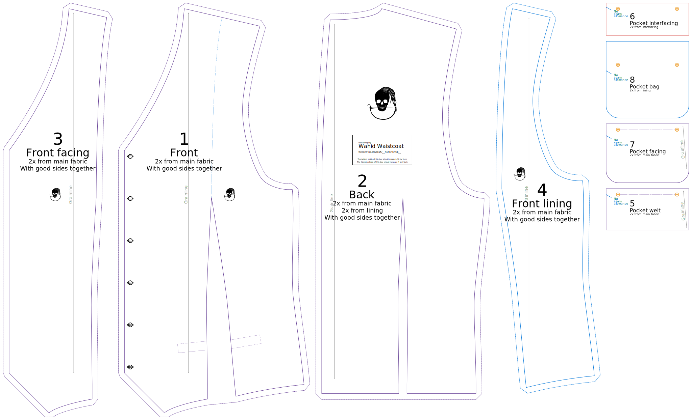
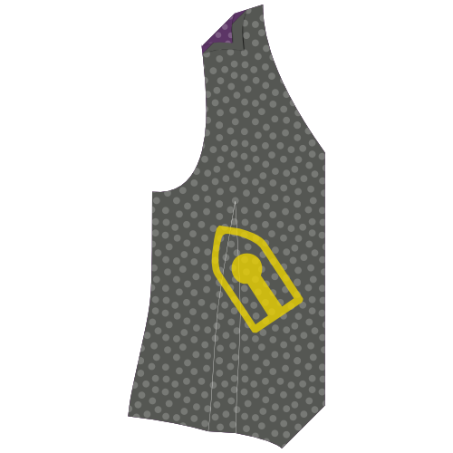
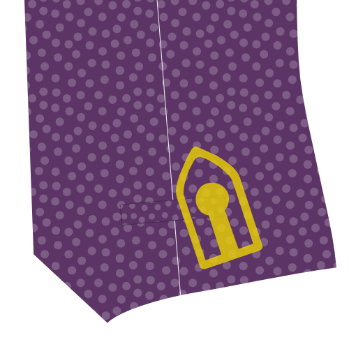
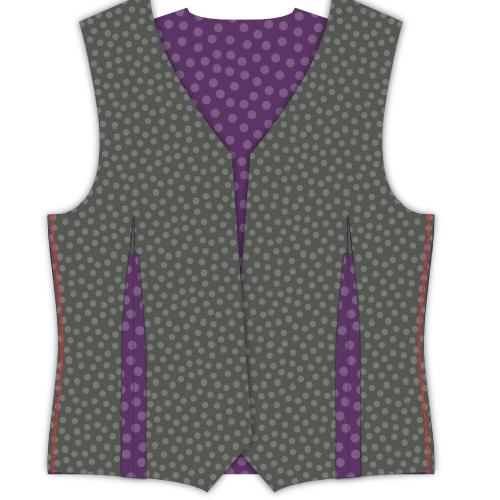

## Ce dont vous avez besoin

Pour réaliser Wahid, vous aurez besoin de ce qui suit :

 - Fournitures de base pour la couture
 - Un mètre de tissu approprié ([voir les Options de tissu](#options-de-tissu))
 - Un mètre de tissu de doublure
 - Entoilage themocollant
 - Boutons

##  Options de tissu

Tous les tissus pour costume sont un excellent choix pour faire des gilets de costume. N'importe quelle boutique de tissu qui en mérite le nom devrait avoir une section pour costume. Vous pouvez juste y entrer, demander où vous pouvez trouver les tissus pour costume, et choisir quelque chose qui vous plaît.

Ces tissus sont généralement en laine, mais vous pouvez tout à fait être un peu plus créatif et choisir autre chose.

> Vous avez tout de même besoin d'un grammage suffisant. Du denim convient, alors qu'une cotonnade légère non.

## Découpe

 - **Tissu principal**
   - Coupez **2 devants** endroit contre endroit
   - Coupez **2 dos** endroit contre endroit
   - Coupez **2 parementures devant** endroit contre endroit
   - Coupez **2 passepoils de poche** endroit contre endroit
   - Coupez **2 triplures de poche** endroit contre endroit
 - **Tissu de doublure**
   - Coupez **2 doublures devant** endroit contre endroit
   - Coupez **2 dos** endroit contre endroit
   - Coupez **2 fonds de poche** endroit contre endroit
 - **Entoilage**
   - Coupez **2 devants** endroit contre endroit
   - Coupez **2 entoilages de poche**

### Avertissements
 - Ne coupez pas la pince **devant**
 - Ne coupez pas la pince **dos**
 - Faites attention à la ligne droit-fil sur le **passepoil de poche** et **la triplure de poche**

Wahid est un patron relativement simple, ci-dessous une disposition typique :

> La [légende des notations](/fr/docs/patterns/notation) explique la signification de tous les différents marquages et lignes de votre ébauche.

## Construction

### Etape 1 : Thermocoller l'entoilage

#### Repasser l'entoilage sur les passepoils de poche

Placez votre passepoil de poche à l'envers, et votre entoilage de poche par dessus.

L'entoilage est un peu plus court que le passepoil, alors veillez à aligner le côté qui a une ligne d'aide marquée dessus.

Pour chaque poche, fixez l'entoilage au fer sur l'envers du passepoil de poche.

#### Appliquer l'entoilage sur les devants

Placez le devant à l'envers, et l'entoilage par dessus.

Fixez l'entoilage en place au fer à repasser.

> **Prenez votre temps**
>
> Ne prenez pas cette étape à la légère, vous voulez repasser vraiment cet entoilage sur votre tissu pour qu'il soit fixé correctement.
>
> Placez le fer et laissez le en place pendant 10 secondes à peu près avec de le déplacer au prochain endroit pour répéter la procédure (sans le faire glisser pour éviter tout risque de déformation).

### Etape 2 : Assembler la parementure devant avec la doublure

#### Coudre la parementure à la doublure

Placez votre parementure devant et la doublure endroit contre endroit. Epinglez les bords de la limite parementure/doublure en place.

Cousez-les ensemble.

#### Ouvrir la couture au fer
Ouvrez la couture entre la parementure et la doublure au fer.

### Etape 3 : Fermer toutes les pinces

#### Fermer les pinces dos

Faites les plis des pinces dos endroit contre endroit, et cousez-les.

> N'oubliez-pas de le faire aussi pour la doublure

#### Fermer les pinces devant
Faites les plis des pinces devant (avec l'entoilage collé dessus) endroit contre endroit, et cousez-les.

### Etape 4 : Repasser toutes les pinces

#### Repasser les pinces devant
Une fois coupées, repassez les pinces devant en ouvrant les coutures.

#### Repasser les pinces dos
Si vous coupez les pinces dos, ouvrez-les au fer, sinon couchez-les vers les côtés au fer.

> N'oubliez-pas de faire la même chose pour la doublure

### Etape 5: Construire les poches

#### Assembler le fond de poche au passepoil de poche

Placez votre fond de poche à l'endroit, et le passepoil de poche par dessus à l'envers.

Alignez le côté droit du fond de poche avec le côté du passepoil qui n'a pas d'entoilage, et cousez-les ensemble à la marge de couture standard.

#### Ouvrir la couture
Lorsque vous avez terminé, ouvrez cette couture.

#### Marquer l'endroit où la poche doit aller

Votre partie de patron devant a une ligne d'aide dessus pour montrer où le passepoil de poche devrait se trouver. Il s'agit de deux demi-rectangles qui se sont assemblés lorsque vous avez fermé la pince pour former la forme de votre poche passepoilée.

Si vous n'avez pas encore marqué les quatre coins de ce rectangle, vous devriez le faire maintenant.

> La poche se trouve sous un certain angle sur votre patron. A partir d'ici, dans les illustrations, je dessinerai la poche droite pour rendre les choses plus faciles.

#### Fixer le passepoil et la triplure de poche

{.fs-row2}
{.fs-row2}

Placez votre pièce devant à l'endroit. Nous allons fixer le passepoil à la ligne inférieure du contour de poche, et la triplure sur la ligne supérieure.

> Si vous n'avez jamais réalisé de poche passepoilée avant, cela peut sembler un peu contre-intuitif de fixer la poche à l'extérieur du vêtement. Une poche devrait se trouver à l'intérieur, non ?
> 
> Détendez-vous, la poche finira à l'intérieur

Votre passepoil ainsi que la triplure de poche ont une ligne guide dessus. Cette ligne doit être alignée avec les bords longs de votre poche.

Placez le passepoil de poche en bas, et la triplure de poche en haut, les deux étant à l'envers.

Alignez soigneusement les lignes guides sur le contour de poche. Elles devraient se trouver maintenant côte à côte, et juste se heurter au milieu de votre poche.

Maintenant cousez le long de la ligne guide qui marque le bord long de votre poche.

> Il est important que les lignes que vous cousez maintenant forment les bords longs d'un rectangle parfait. Cela va déterminer la forme de votre poche, alors si vous faites une ligne plus longue que l'autre, ou si elles sont désalignées ou non parallèles, votre poche aura un mauvais aspect.

#### Ouvrir la poche

Il est temps d'ouvrir avec attention la poche. Commencez au milieu de la poche, et coupez le long du bord le plus long vers le côté.

Au bords de votre poche, vous devrez arrêter de couper en ligne droite au milieu et couper plutôt vers la fin de votre ligne de piqûre à un angle de 45 degrés.

> Ce petit triangle que vous coupez à présent est important. Veillez à viser avec attention où vous devez couper, comme vous devez couper jusqu'au niveau de la fin de vos points sans couper ces derniers.

#### Ouvrir les marges de couture

Ouvrez au fer les marges de couture le long des bords longs de votre poche.

#### Mettre la triplure de poche vers l'arrière et repasser

Rabattez la triplure de poche vers le côté arrière et repassez-la.

#### Repasser les triangles sur les côtés courts

Déplacez votre triplure de poche hors du chemin pour révéler ces petits triangles sur les côtés de votre poche.

Pliez-les vers l'arrière en vous assurant de garder votre ouverture de poche en forme de rectangle net, et repassez-les.

#### Rabattre les passepoils vers l'arrière, plier et repasser

{.fs-row2}
{.fs-row2}

Rabattre le passepoil avec la poche attachée vers l'arrière.

Pliez le passepoil à l'endroit où il atteint le haut de la poche. Le passepoil devrait couvrir toute l'ouverture de poche.

> L'illustration montre ceci depuis l'arrière comme c'est plus facile de voir ce qui se passe de cette façon. Toutefois, vous devriez vérifier de l'avant pour être certain que la poche passepoilée ait un bel aspect.

#### Coudre les triangles de la poche

Placez le devant à l'endroit et veillez à ce que la triplure de poche et le passepoil soient bien à plat.

Rabattre le devant verticalement au bord de votre poche pour révéler ce petit triangle sur le côté court de votre ouverture de poche.

Cousez ce triangle juste à côté du pli et du bord de la poche.

#### Fermer le fond de poche

Cousez votre triplure de poche au fond de poche pour finir votre poche.

> Cela va sans dire, mais soyez attentif à ne pas coudre votre fond de poche à l'avant de votre gilet.

#### Repasser votre poche complétée

Lorsque vous avez fini, donnez à votre poche un bon coup de fer final.

### Etape 6 : Couture milieu dos

Mettez vos deux pièces dos endroit contre endroit et cousez la couture milieu dos.

Lorsque c'est fait, ouvrez cette couture au fer.

> N'oubliez pas de faire la même chose pour la doublure

### Etape 7 : Assembler le dos aux devants

Mettez votre dos à l'endroit et les devants par dessus à l'envers. Alignez les coutures des côtés, épinglez et cousez.

Lorsque c'est fait, ouvrez ces couture au fer.

### Etape 8 : Assembler les épaules

Alignez les coutures d'épaule, cousez-les, et ouvrez les coutures au fer.

> N'oubliez pas de faire la même chose pour la doublure

### Etape 9 : Insérer la doublure

#### Insérer la doublure dans le gilet

Placez votre doublure sur votre gilet, endroit contre endroit. En d'autres termes, le gilet devrait avoir l'endroit à l'intérieur et l'envers à l'extérieur.

#### Epingler la doublure au tissu

Alignez les bords de la doublure et du tissu, et épinglez-les en place.

Démarrez au milieu dos, et suivez l'encolure jusqu'en bas du devant. Faites de tour, mais laissez environ 15 cm d'ouvert au milieu dos.

#### Coudre la doublure au tissu

Avec votre doublure proprement épinglée en place, cousez la doublure et le tissu ensemble.

N'oubliez pas de laisser une ouverture de 15 cm au milieu dos.

#### Retourner le gilet et repassez les bords

A travers l'ouverture que vous avez laissée, retournez le gilet à l'endroit.

Repassez les bords que vous venez de coudre, en vous assurant de rouler le tissu un peu de façon à ce que la doublure soit toujours invisible.

### Etape 10 : Finir les emmanchures

#### Epingler vers l'intérieur la marge de couture du tissu

Tout le long de l'emmanchure, épingler vers l'intérieur la marge de couture du tissu principal de votre gilet. Tout en faisant cela, gardez la doublure hord du chemin.

#### Epingler la doublure

Maintenant, rabattez votre doublure un peu avant le bord de l'emmanchure et épinglez-là.

#### Coudre à la main la doublure au tissu principal

Utilisez un point glissé pour coudre à la main la doublure au tissu principal tout le long de l'eemanchure.

### Etape 11 : Fermer l'ouverture
Vous vous souvenez du trou que nous avons laissé à l'étape 9 ? Il est temps de le fermer.

Utilisez un point glissé pour coudre à la main la doublure au tissu principal et fermer l'ouverture.

### Etape 12 : Réaliser les boutonnières

Si vous ne l'avez pas déjà fait, transférer l'emplacement des boutonnières de votre patron vers votre tissu.

Réalisez ces boutonnières.

### Etape 13 : Attacher les boutons

Epinglez votre gilet de manière à le fermer et transférez l'emplacement des boutonnières vers le côté des boutons.

Cousez ces boutons.

> Vous pourriez également transférer l'emplacement des boutons depuis le patron. Cependant, transférer les boutonnières que vous venez de faire vous assure que les boutons et les boutonnières seront bien alignés, même si votre(vos) boutonnière(s)even if your buttonhole(s) est(sont) légèrement décalée(s).

### Etape 14 : Optionnelle : Faites un point de piqûre sur les bords

Si vous le désirez, Vous pouvez optionnellement faire un point de piqûre sur les bordures de votre gilet.

Le point de piqûre doit être réalisé à la main. Vous pouvez faire courir un point avant à quelques mm des bords de votre gilet, mais ne laissez vos points apparaître en surface que sur quelques fils. Vous avez certainement dû déjà voir ce genre de finition sur vos vestes de costume.

> Vous pouvez faire un point de piqûre avec un fil de la même couleur, ou utiliser une couleur contrastante si vous êtes d'humeur téméraire.

> Alors que le point de piqûre ajoute un aspect distinctif, il bloque également votre tissu à votre doublure/parementure ce qui empêche les choses de se déplacer.

Après cela, vous voudrez probablement repasser votre gilet.
